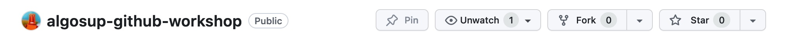

# ALGOSUP Github Workshop

_Github workshop using git bash &amp; other tools..._

## Step 1

* Log on Github
* Fork this repository

## Step 2

* Install Git bash (if not already installed)
  * Download URL: https://git-scm.com/downloads
  * Answer all the questions during the installation process.
  * ⚠️ Regarding the `line-ending` settings, select `Checkout as-is, commit as-is` ⚠️

## Step 3

* Download the Git cheat-sheet from here: [git-cheat-sheet-education.pdf](docs/git-cheat-sheet-education.pdf)
* Git clone your fork in your local folder
  * For this you will have to provide a login and password
  * the login is your github login (email or username)
  * the password is usually a token you created for a project/machine/OS/IP location (the token is not your github password)
* You should now have a local repository of this workshop repository

## Step 4

_let's the fun begin._ For this workshop we will use the Lua version of the HARFANG 3D engine to practice the usage of Git bash/Git VS Code.

* Download the HARFANG tutorials from [here](https://github.com/harfang3d/tutorials-hg2) (as a zip file)
* Find the tutorial named `game_mouse_flight.lua`
* Copy this Lua script into your local repository (at the root of the directory)
* Git add this new file
* Git commit
  * A comment is mandatory
* Git push
* Go to your online repository on github.com and check the updated page

## Step 5

* Download the Lua release of HARFANG 3D for Windows64 from here: [HG 3.2.7 Releases](https://github.com/harfang3d/harfang3d/releases)
* Deploy the binaries of Lua into a new directory of your local repository. A `bin/` directory should be fine
* Copy the `resources` directory from the tutorials into your local repository
* Git add theses new folders and files. Commit, comment, push.
* Go to your online repository on github.com and check the updated page

## Step 6

* Create a new .bat file to compile the `resources` using HARFANG's `assetc` command line (something like `assetc.exe ressources`)
* Test the .bat file
* Git add, commit, comment, push
* Create a new .bat file to run the `game_mouse_flight.lua` script (something like `lua.exe game_mouse_flight.lua`)
* Test the .bat file, the Lua program should run and open a window
* Git add, commit, comment, push
* Go to your online repository on github.com and check the updated page

## Step 7

_Now let's use the branch feature!_

### Understanding Commits and Branching in Git

When you create a commit in Git, the process works as follows:

1. You're on branch `A`.
2. You make changes, add them to the staging area with `git add`, then create a commit with `git commit`.
3. This commit is now recorded on branch `A`.
4. If you now switch to another branch, let's call it `B`, using `git checkout B` (or `git switch B` in newer versions), this commit remains on branch `A`. The branch `B` isn't aware of this commit unless you merge or move it in some manner.
5. Not doing a `git push` yet doesn't affect how commits are associated with branches locally.

If you want the commit to be present on branch `B`, you'd have to merge branch `A` into branch `B` or use other methods like cherry-picking to specifically move that commit from one branch to another.

### Now that you've got a good understanding of what a branch is, let's start!

* Improve this readme
  * Add a description of the mini game
  * Add a screenshot of the mini game
  * Git add, **don't commit yet!**
  * Create a branch, call it `readme-update`
  * Git commit, push
  * Go to your online repository on github.com and check the new branch

## Step 8

* Go to your online repository on github.com and check the updated page
* Let's merge

## Step 9

* Let's prepare a release :)

